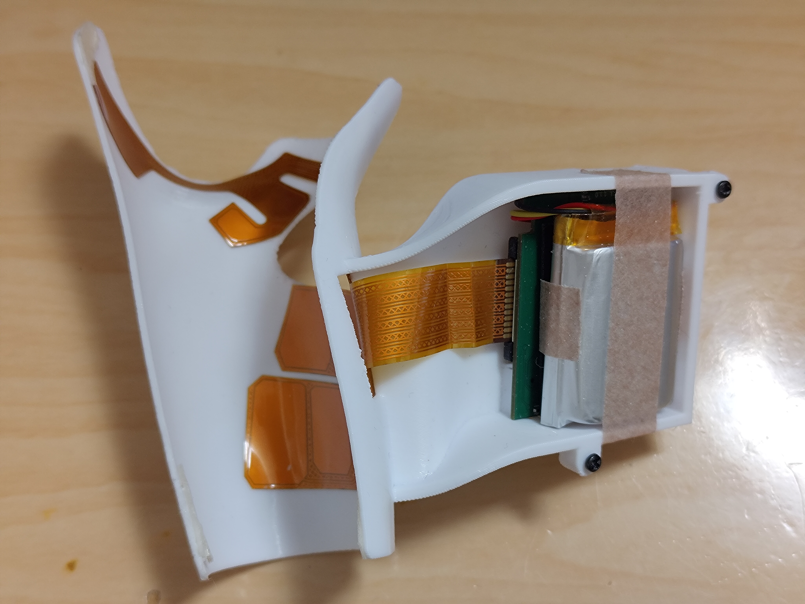
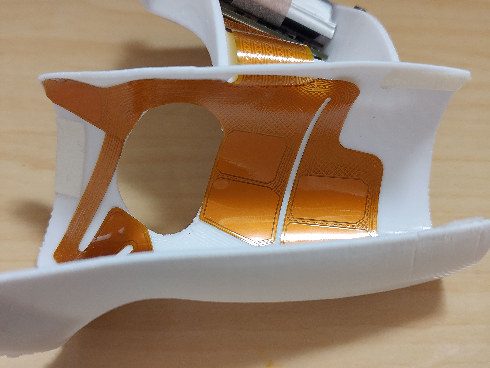
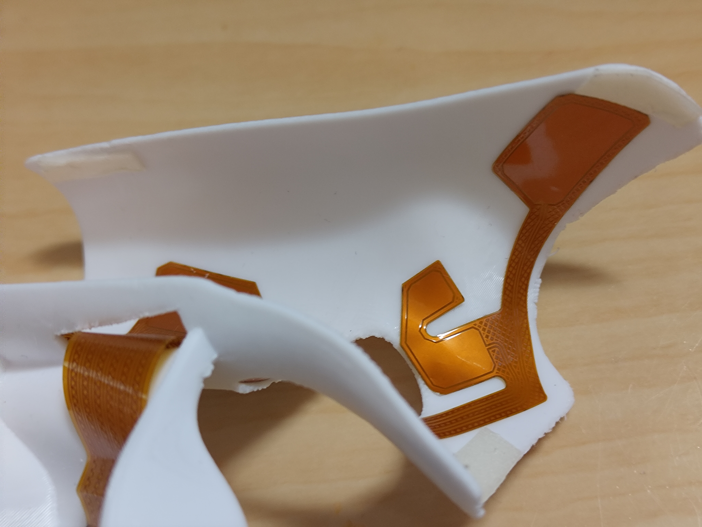

# Pico4Sheet
ContactSheet( https://store.diver-x.jp/products/contactsheet )をPico4のコントローラで使用するためのフレキ基板&筐体設計データ
* Pico4Ultraについてはトラッキングセンサ位置に干渉する可能性があるため、干渉を避けるための設計変更が恐らく必要です。

## 現状
* とりあえず使用可能です。
* センサ配置の都合上 筐体の下部を覆うため電池の取り外し時等にコントローラから外す必要あります。
* 筐体の構造のみではコントローラに十分固定できないため、両面テープ等により追加で固定が必要です。
  * 私は ニチバン 両面テープ ナイスタック (粗面) NW-P15SF を小さめに切って、さらに少し粘着力を落とした上で使用しています。

## FlexGerber
* タッチセンサ用フレキ基板のガーバーファイルです。左右それぞれをjlcpcbで製造を行う想定です。
  * FlexGerber/Gerber_Pico4Sheet_2L_2024-09-26.zip 左用
  * FlexGerber/Gerber_Pico4Sheet_2R_2024-09-26.zip 右用
* 割引の関係上、左右それぞれの注文を別々に行う必要があります。
* 製造設定
  * Gold Fingers: Yes
  * Gold Fingers Thickness: 0.3mm
  * EDA Software: Other (実際のところファイル自体はEasyEDA Proで作成されていますが、その場合少量(5枚)での特別価格($2)が適用されないためOtherにする必要があります(サポートに確認済))
  * Stiffener: polyimide
  * Polyimide Thickness: 0.25mm
  * Mark on PCB: Remove Mark

## Model
* 筐体データです。
* "Pico 4 controller 3D scan" by LWC (CC by 4.0) https://www.printables.com/model/300620-pico-4-controller-3d-scan
  のデータを元に作成されています。
  * スキャンデータは僅かに実際のコントローラより大きかったため縮小しています。
  * コントローラを覆うようにメッシュを生成して、コントローラに取り付けられる構造を作成しています。
  * 筐体がコントローラを挟めるように横方向を95%に縮小しています。
  * 以上をベースとして筐体部分等を追加しています。
* Pico4Sheet_v6.rsdocx, Pico4Sheet_v6.stp
  * 設計データです。作成中のデータについては訳が分からない状態になっているためほぼ完成データのみです。
* stl
  * 3Dプリント用データです。サポートが難しいデータになってしまっています。
  * Pico4Sheet_v6.3mf として参考としてのプリント設定を置いておきますが、サポートを強引に外すことを前提として作成したためあまり参考にならないと思います。(接触面が小さすぎて不安定なためサポートのトップ面との間隔を0に設定しています)
* フタのねじはM1.7のタッピングねじを使用しています。
* 現状の問題点
  * ボタンの穴が小さいためオリジナルのボタン部品は入らない状態です。
  * フタの構造はあまりちゃんとした形になっていません。(実際のところフタは必要ではないです)
  * フタのみでは基板およびバッテリーの固定に不十分なためテープ等で固定する必要があります。
  * 基板のUSB端子部分はプリント時の誤差により入りにくい可能性があります(恐らく曲げるなどをすると入ります)

## 使用方法
* 筐体にフレキ基板を両面テープで貼り付ける。
  * Grip部分から貼ると多少位置合わせしやすいです。
  * 接点位置は手のサイズに合わせて変更した方が良い可能性があります。
* フレキ基板のFPC部分を折り畳んで位置調整がしやすいようにする。(あまり位置調整はできていないので基板のコネクタに対して少し斜めです)
* ContactSheetの基板、絶縁用の板、電池をテープ等でまとめた上で基板のコネクタにフレキ基板を差し込んで固定する。
  * コネクタの黒い部分をFPC側に引いてスライドすると固定が外れる仕組みになっています。
  * 接触が悪いと指が一部動かなくなります。
* 基板を筐体に固定する。
  * USB端子部分を凹みの部分に引っかけると固定されます。
  * テープ等で追加で固定を行なった方が良いです。
* フタを付けて固定する(任意)
  * M1.7のタッピングねじを使用することで固定できるはずです。

## 組み立て例

## License
* Modelについて、"Pico 4 controller 3D scan" by LWC (CC by 4.0) https://www.printables.com/model/300620-pico-4-controller-3d-scan
  のデータを元に作成されているため、CC by 4.0 が適用されます。
* 他の部分についても CC by 4.0 とします。
